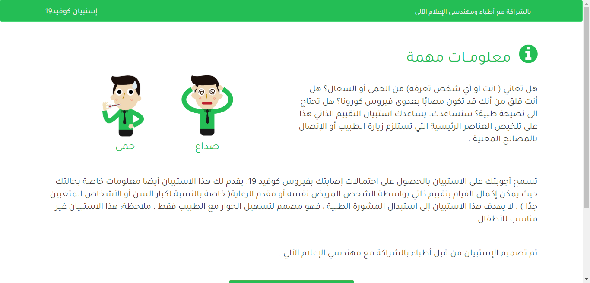
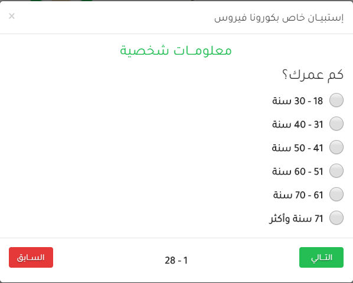
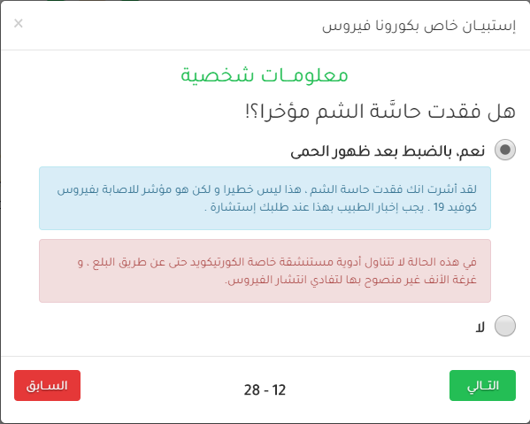
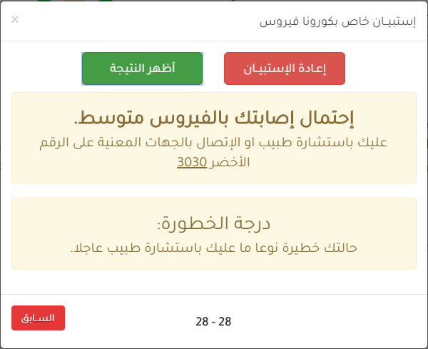

# COVID19 TEST - إستبيــان كوفيد19 :mag: :heavy_check_mark:

[](LICENSE)

Simple web app for checking if someone has coronavirus symptoms :mask: and gives him/her a result about that.

> PS: This website is designed for Algerian people.

### Problem Statement :question:

Do you (or someone you know) have a fever or cough? Are you worried that you might be infected with the Corona virus? Do you need medical advice? We will help you.

This self-assessment questionnaire helps you summarize the main factors that necessitate visiting a doctor or contacting the departments concerned

### What we are doing :100:

The questionnaire allow you to obtain the probabilities of you being infected with the Covid19 virus. This questionnaire also provides information about your case where a self-assessment can be completed by the sick person himself or the caregiver (especially for the elderly or very tired people)

The questionnaire was designed by doctors in partnership with computer software engineers.

## Features :pushpin:

- Simple to use. :yum: :ok_hand:
- Responsive for mobile. :iphone: :computer:
- Arabic language. :heart: :boom:
- Guides you (depending on your answers). :heavy_exclamation_mark: :warning:
- Gives you the possibility of infection with the virus. :heavy_check_mark: :page_with_curl:

### Used Languages :hammer:

- Java Script.
- HTML.
- CSS.

## Used Libraries :file_folder:

- jQuery v1.12.1
- Bootstrap v3
- Font-awesome

## Requirements :pencil:

You'll need just a browser (Chrome, Firefox...)

## Screenshots :camera:

### Home page



### Question example



### Guides example



### Result example



## Installation :white_check_mark:

1. Download the repository files (project) from the download section or clone this project by typing in the bash the following command:

```
git clone https://github.com/IsmailBourbie/Covid19QuestDz.git
```

2. Open **index.html** file with a browser

   > You can see the app on this site: [covid19test-dz.com](https://covid19test-dz.com/)

## Contributing :bulb:

If you want to contribute to this project and make it better with new ideas, your pull request is very welcomed. If you find any issue just put it in the repository issue section, thank you.

## Licence :page_facing_up:

This project is licensed under the MIT License - check [LICENSE.md](LICENSE) file for more details.

## Contact :e-mail:

- [Linkedin](https://www.linkedin.com/in/ismail-bourbie)
- [Facebook](https://www.facebook.com/ismail.bourbie)
- [Instagram](https://www.instagram.com/ismail_bourbie)
- [Twitter](https://twitter.com/Ismail_bourbie)
